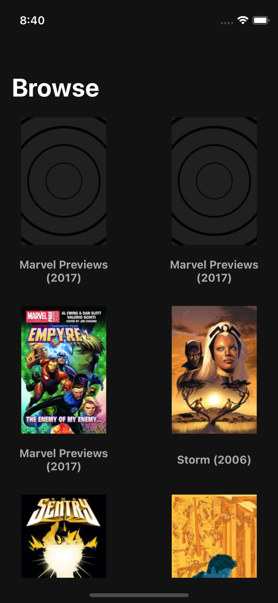
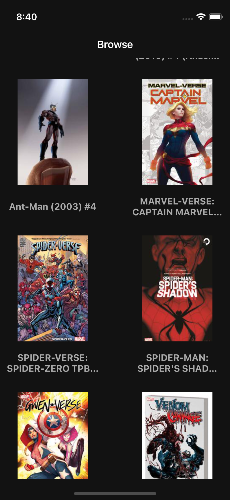
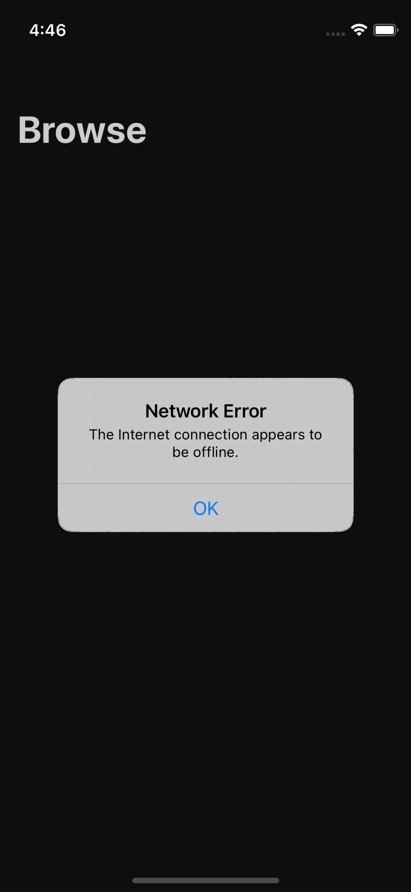

# Marvel Comics
A sample iOS app that utilizes the Marvel API to display a list of comics using pagination. The app is structured to use the MVVM-C pattern.

# UI Preview:
|               |               |             |             |
| ------------- | ------------- | ----------- | ----------- |
|  |  |  | 

# Running the project:
In order to run the project, please provide your API keys within the **MarvelSecrets** configuration enum. This is located within the **Configuration** folder. Please don't hesitate to reach out if you encounter any issues. 

Obtain your API key at: https://developer.marvel.com/

```
enum MarvelSecrets {
    static let privateKey = "Add-Your-Private-API-Key"
    static let publickKey = "Add-Your-Public-API-Key"
}

``` 


